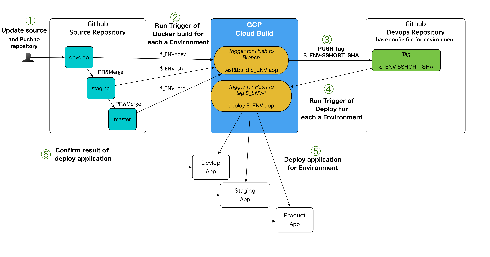

# Cloud Build Sample Devops

This is sample for Full Automation CI/CD with the Cloud Build of GCP.
You need to use the [Cloud Build](https://cloud.google.com/cloud-build/?hl=ja)



1. Create GKE Cluster for each a environment on GCP
	- develop cluster-name : dev-cb-sample-server
	- staging cluster-name : stg-cb-sample-server
	- product cluster-name : prd-cb-sample-server
2. Fork or clone the source repository [cb-sample-server](https://github.com/sanleon/cb-sample-server)
3. Create Trigger of Deploy Application for Register tag to devops repository on Cloud Build.
   	- Cloud Build trigger setup for develop : [dev.cloudbuild.yaml](./dev.cloudbuild.yaml)
	- Cloud Build trigger setup for staging, product : [cloudbuild.yaml](./cloudbuild.yaml)


## Manual Deploy

### Prepare

- install gcloud sdk
- install kubectl

## Deploy

```~shell
 $ gcloud container clusters get-credentials [cluster-name] --zone [zone-name] --project [project-name]
 $ kubectl create configmap server-config -o yaml --from-file=config.yaml=config/config-[env].yaml --dry-run=true | kubectl replace -f -
 $ kubectl apply -f deployment.yaml
 $ kubectl apply -f service.yaml
```